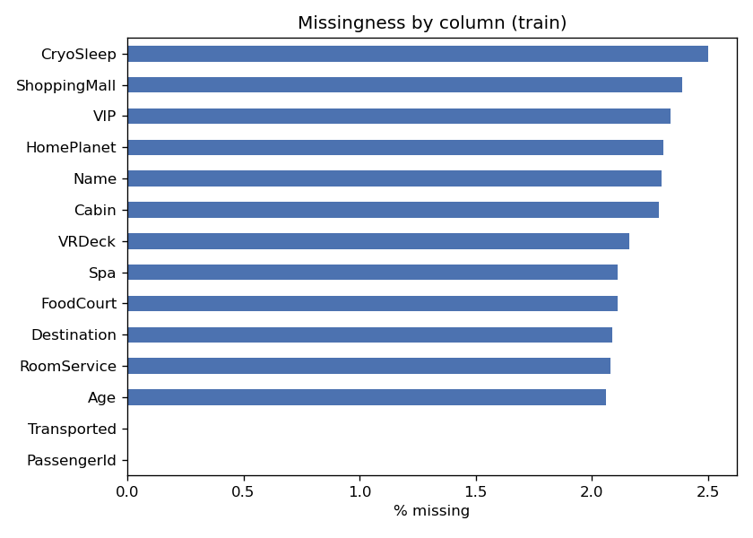
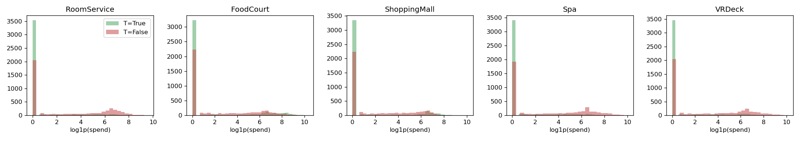
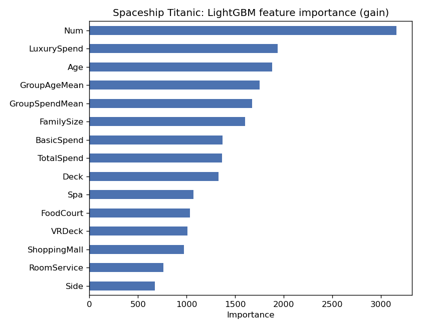
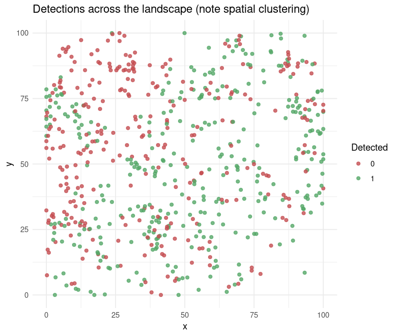

# Spaceship Titanic: An Honest, End-to-End Tutorial

A complete walkthrough of a Kaggle tabular competition that prioritizes **honest
evaluation** over leaderboard-chasing, and then **translates the entire workflow
to a wildlife species-detection problem** to show the techniques are general.

The task: predict which passengers were **transported to an alternate dimension**
(binary classification, scored on accuracy). The dataset is a toy, but its shape
(compound IDs, pervasive missingness, mixed feature types) is exactly what real
survey data looks like.

**Result:** a clean LightGBM pipeline scoring **0.805 public leaderboard
(~top third of 1,931 teams)**, with cross-validation that matches the leaderboard
so it will hold up on the private split.

This tutorial is built around three ideas that recur in every applied ML project:

1. **Domain-driven feature engineering beats algorithm tuning.**
2. **Trust a clean held-out estimate, not noisy leaderboard wiggles.**
3. **Feature importance is not predictive value when features are correlated.**

---

## How to run

```bash
# 1. Install dependencies
pip install -r requirements.txt

# 2. Download the data (needs a Kaggle account + API token)
kaggle competitions download -c spaceship-titanic -p data/raw
cd data/raw && unzip spaceship-titanic.zip && cd ../..

# 3a. Run the reproducible scripts in order
python src/01_eda.py
python src/02_baseline_model.py      # LightGBM baseline + submission
python src/03_models_ensemble.py     # richer features, XGBoost, blend, importance
python src/04_tuning_ensemble.py     # Optuna tuning + 4-model ensemble

# 3b. ...or read/run the notebook (also runs on Kaggle as-is)
jupyter notebook notebooks/spaceship_titanic_tutorial.ipynb
```

## Repository layout

```
spaceship-titanic/
  src/                     reproducible pipeline scripts
    01_eda.py              exploratory analysis + figures
    features.py            shared feature engineering
    02_baseline_model.py   LightGBM baseline, first submission
    03_models_ensemble.py  v2/v3 features, XGBoost, blend, importance
    04_tuning_ensemble.py  Optuna tuning + CatBoost/HistGBM ensemble
  notebooks/               self-contained tutorial notebook (Kaggle-ready)
  outputs/figures/         saved plots used below
  wildlife_translation/    the ecology finale, in R (see its README)
  TUTORIAL.md              detailed development log (every step, every number)
```

---

## 1. Exploratory data analysis

Four questions shape every later decision.

**Is the target balanced?** Yes, 50.4% / 49.6%. Accuracy is a fair metric and no
resampling is needed.

**How bad is missingness?** Every feature column is about 2 to 2.5% missing, and
**24% of rows have at least one missing value**. We cannot drop incomplete rows
without losing a quarter of the data, so imputation is mandatory.



**What hides in the compound fields?** `PassengerId = gggg_pp` encodes a **travel
group** (6,217 groups; party sizes 1 to 8), and `Cabin = deck/num/side`. People
travel, and are transported, together, so group structure is predictive.

**Is there a deterministic relationship to exploit?** Yes, the single most
important one. `CryoSleep` passengers (in suspended animation) are transported
81.8% of the time versus 32.9% otherwise, and they **spend exactly zero** on every
amenity. That gives a rare deterministic imputation rule: any spend implies awake,
and asleep implies zero spend.



## 2. Feature engineering (where the gains actually come from)

From the raw 13 columns we build 39 features (`src/features.py`):

- **Decode compound IDs**: group and group size from `PassengerId`, deck/num/side
  from `Cabin`, surname and family size from `Name`.
- **Deterministic CryoSleep rule**: fill CryoSleep from spend and vice versa.
- **Group-based imputation**: recover a missing `HomePlanet` from the passenger's
  groupmates (a group shares a home planet), which beats a global guess.
- **Spend structure**: luxury versus basic amenities, per-amenity flags, log
  transforms for skew.
- **Group aggregates**: mean group spend and age.

All of it is computed on train and test together using only IDs and features
(never the target), so nothing leaks.

## 3. Modeling with honest cross-validation

LightGBM with 5-fold stratified CV and early stopping. The full arc:

| Stage | CV accuracy | Public LB |
|-------|-------------|-----------|
| LightGBM baseline (24 features) | 0.8108 | 0.80547 |
| Domain features v2 + v3 (39 features) | 0.8127 | 0.80547 |
| Optuna hyperparameter tuning | **0.8139** | 0.80009 |

Two lessons jump out of that table.

**Domain features moved the needle; tuning did not.** A model on the raw columns
scores about 0.79. Decoding the IDs and the CryoSleep rule takes it to 0.805.
That is where the skill lives.

**The best CV score gave the worst leaderboard score.** Tuning 40 Optuna trials to
maximize CV produced an optimistically biased estimate (the maximum of many noisy
numbers), and it did not generalize. The public leaderboard is only ~half the test
set, so its 0.002 wiggles are about 3 passengers of noise. **We kept the robust
v3 model, not the higher-CV tuned one.** Trust the honest signal.

## 4. Reading feature importance carefully



`CryoSleep` was the strongest single predictor in EDA, yet it barely registers in
the model's importance ranking. The reason is instructive: the spend features are
near-perfect proxies for it (asleep implies zero spend), so the model reads that
signal through them and the credit is split. **When features are correlated,
importance understates each one.** Always pair an importance plot with a
correlation check.

---

## 5. Finale: the same workflow in ecology

The payoff. Spaceship Titanic's structure is exactly what a real **wildlife
survey** looks like, so the entire pipeline transfers. In
[`wildlife_translation/`](wildlife_translation/README.md) (written in R) we
predict whether a species is **detected** at a survey site, and every step maps
across:

| Spaceship Titanic | Wildlife survey |
|-------------------|-----------------|
| `Transported` | species `detected` |
| `PassengerId` group | sites nested in a **transect** |
| CryoSleep implies zero spend | passive site implies zero survey **effort** |
| impute HomePlanet from group | impute land cover from transect-mates |
| trust CV over noisy leaderboard | **spatial-block CV** over naive random CV |
| spend masks CryoSleep importance | canopy and NDVI (r = 0.9) split importance |

The one genuinely new ecological wrinkle is **spatial autocorrelation**: nearby
sites resemble each other, so a naive random split lets the model peek at
neighbors and look better than it is. Holding out whole spatial blocks gives the
honest number.



| CV scheme | Accuracy | AUC |
|-----------|----------|-----|
| Random 5-fold | 0.74 | 0.81 |
| **Spatial-block** | **0.67** | **0.76** |

Random CV is optimistic by about 0.07 accuracy purely from ignoring space. The
number to report is the spatial-block one. This is the identical lesson to Kaggle,
in a setting where the trap has a name.

---

## The three takeaways

1. **Domain logic beats tuning.** Decoding IDs and the CryoSleep rule drove the
   gains; 40 trials of hyperparameter search did not.
2. **Trust the honest held-out estimate.** A clean cross-validation number beats a
   flattering leaderboard, and in spatial data that means spatial-block CV.
3. **Importance is not predictive value.** Correlated features hide each other;
   read importance alongside correlations.

## Reproducibility

- Python via anaconda (pandas, scikit-learn, lightgbm, xgboost, catboost, optuna);
  see `requirements.txt`.
- R 4.6 with `ranger`, `dplyr`, `ggplot2`, `pROC` for the wildlife translation.
- All randomness is seeded. Raw competition data and credentials are git-ignored;
  the wildlife dataset is simulated by `wildlife_translation/00_simulate_survey_data.R`.
